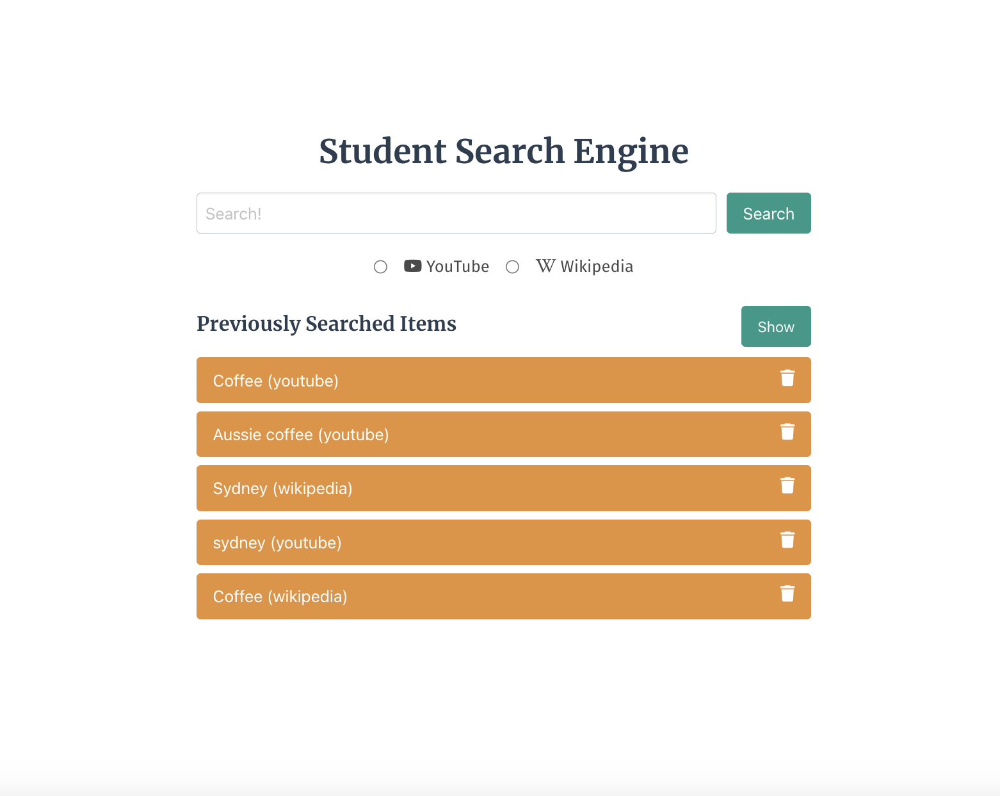
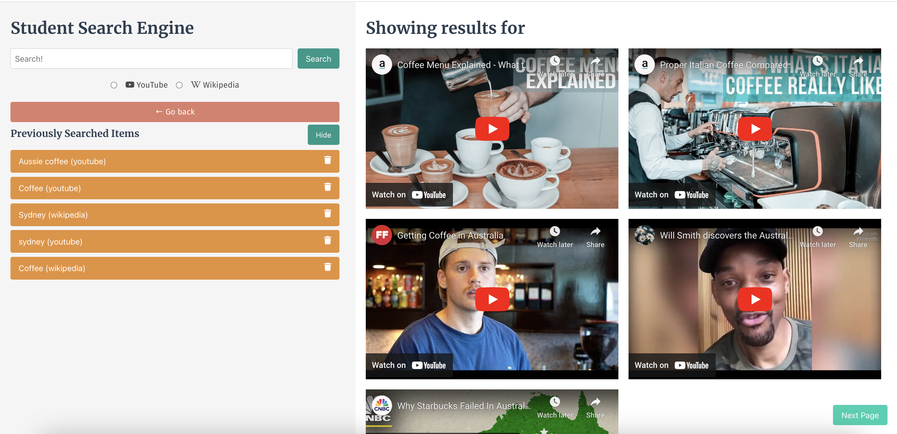
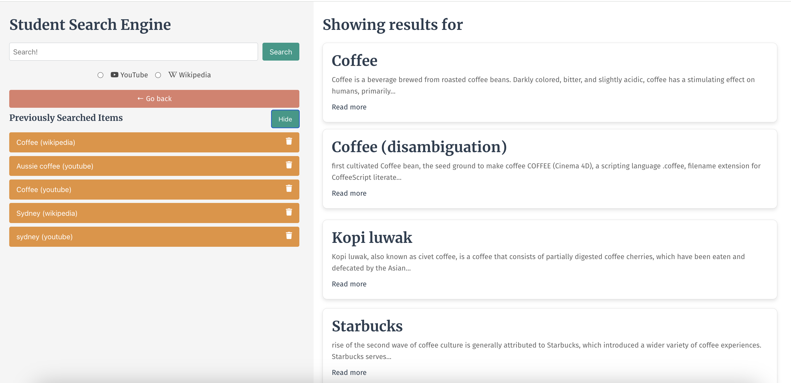

# Project1 : Student Search Engine

## About The Project

At the conclusion of each phase of the Bootcamp, we will work with a group of our fellow students to create a project. A project is collaborative work among a group of developers to create an application that solves a real-world problem. Projects model the experience you’ll encounter in every development role at any company, from large multinational businesses to small startups. Coding is collaborative.

This will use everything we've learned over the past six modules to create a real-world front-end application that you’ll be able to showcase to potential employers.

### Project Requirements

- Use a CSS framework other than Bootstrap.
- Be deployed to GitHub Pages.
- Be interactive (i.e., accept and respond to user input).
- Use at least two server-side APIs.
- Must include one modal. It does not use native browser alert, confirm, or prompt functionality.
- Use client-side storage to store persistent data.
- Be responsive.
- Have a polished UI.
- Have a clean repository that meets quality coding standards (file structure, naming conventions, follows best practices for class/id naming conventions, indentation, quality comments, etc.).
- Have a quality README (with unique name, description, technologies used, screenshot, and link to deployed application).

### What we are building

In this project, our team has created a two-page website where students are able to search keywords with defined result type (YouTube/ Wikipedia) and get the most relevant results. In order to search more effectively, our page provides a list of searched items that users can retrieve previous search results anytime. 

**User Story**

AS A STUDENT  
- I want a Student Search Engine
- SO THAT I can easily search for videos and wiki articles by searching the key words on one-stop search engine

**Acceptance Criteria**

- GIVEN a student
- WHEN I select search type (YouTube/ Wikipedia) and hit Search
- THEN I am directed to Search Result Page with a series of search results which are relevant to the search criterias
- WHEN I want to refer to my previous searches
- THEN there is a previously searched history section on search result page to display all searched keywords that I can click to search again
- WHEN I want to delete the searched items
- THEN the results will be deleted from browser by clicking the delete icon next to searched items

## Project Status: Completed

## Project Screenshots:

## Project Link: To Be Provided

## Built With

- HTML, CSS & JS codes
- Bulma CSS Framework
- Font Awesome Library
- YouTube API
- Wikipedia API

## Main contributors & contacts 
- Jovana Vukovic (Github: Jovana667)
- Zoe Zhong (Github: Zoooe-Brooo)
- Ashley Cowan  (Github: Ashley55mv)
- Wendy Xiao  (Github: Wendyydxiao)

## Acknowledgments
Inspired by BootCamp Server side API mini project - Library of Congress Search Engine (local link: http://127.0.0.1:5500/06-Server-Side-APIs/01-Activities/27-Stu_Mini-Project/Main/index.html)
